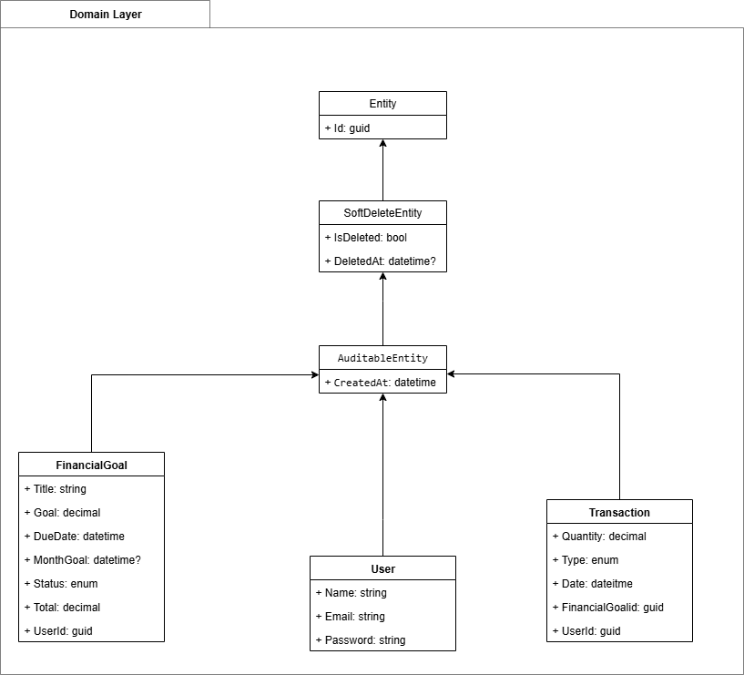

Projeto: 4 - Gerenciador de Objetivos Financeiros

Repositório para o código do desafio 4 da Mentoria Next WaveEducation

Sistema Gerenciador de Objetivos Financeiros

Tecnologias

C#.
Autorização com JWT e utilização de Bearer Token.
MS SQL Server.
Arquitetura Hexagonal.

Funcionalidades

Permite o cadastro, edição e remoção de objetivos financeiros.
Permite o cadastro e remoção de transações financeiras.
Permite o cadastro, edição e remoção de usuários.
Permite login de usuários.
Permite geração de relatórios dos objetivos financeiros em pdf.
Permite simular o crescimento financeiro por período de tempo.
Envia emails para determinadas ações no sistema:
 - Criação de objetivo financeiro.
 - Edição de objetivo financeiro.
 - Remoção de transação financeira.
 - Efetuação de transação financeira. 
 - Remoção de transação financeira.

- Representação em UML das classes

